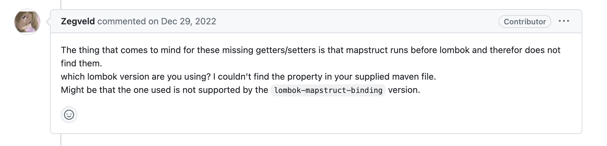
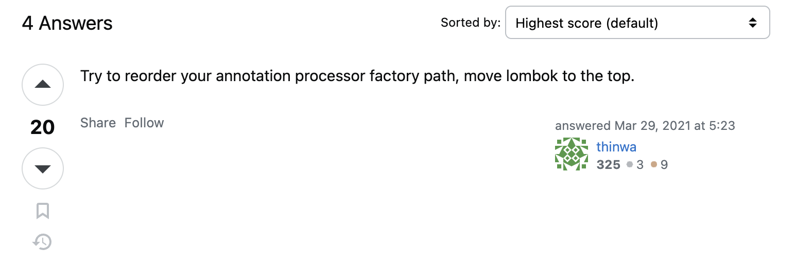

## Mapstruct 빌드 시 발생하는 문제
회사 업무 파악을 하다가 서비스 코드를 빌드하는데 아래와 같은 문구가 IDE에 출력되었다.
```java
error: No implementation was created for ExampleMapstruct due to having a problem in the erroneous element java.util.ArrayList. Hint: this often means that some other annotation processor was supposed to process the erroneous element. You can also enable MapStruct verbose mode by setting -Amapstruct.verbose=true as a compilation argument.
1 errors
```
**No implementation was created for ExampleMapstruct due to having a problem in the erroneous element java.util.ArrayList.** 회사에서는 보일러 플레이트 코드를 해소하기 위해 Mapstruct 라이브러리를 사용한다. 빌드 시 발생한 문제는 그런 `ExampleMapstruct`에서 발생한 문제였다. 처음에는 버전이 맞지 않은 거 같아서 확인해봤는데 롬복을 비롯한 라이브러리들의 버전에는 이상이 없었다. 문제가 생겼으니 해결해야 직성이 풀리는 법. 오늘은 그 해결기를 적어보려고 한다.

## 구글링, 그 보다 선행되어야 할 것
### 깃허브 리포지토리의 이슈를 확인하자
보통 이런 오픈 소스 라이브러리들은 깃허브에 리포지토리가 있다. 깃허브 리포지토리의 issue에서는 우리가 라이브러리를 사용하면서 만났던 예외들의 질문글들이 많다. 보통 이런 질문글에 라이브러리 개발자가 직접 답변해주면서 해답을 얻는 경우가 많다. 따라서 바로 [깃허브로 달려갔다](https://github.com/mapstruct/mapstruct/issues/3124).



질문자와 상황이 정확이 일치하지 않았지만, 컴파일 시 발생했던 문구가 동일했기 때문에 답변을 얻을 수 있을 거 같았다. 게시글의 코멘트에는 아래와 같은 내용이 있었다.

>getter / getter가 누락되는 이유는 **mapstruct가 롬복보다 먼저 실행되므로 찾지 못한다는 것입니다**.
> 어떤 롬복 버전을 사용하고 계신가요? 제공 한 메이븐 파일에서 속성을 찾을 수 없습니다.
> 사용 된 것이 lombok-mapstruct-binding version에서 지원되지 않는 것일 수 있습니다.

**mapstruct이 롬복보다 이전에 동작할 때 getter와 setter를 찾을 수 없다는 내용**이다. 또 롬복의 버전이 lombok-mapstruct-binding version에서 지원되지 않은 것일 수 있다는 코멘트도 인상적이다.

문제를 찾은 거 같다. 바로 Mapstruct이 롬복보다 먼저 동작해서 발생한 문제인 느낌이 온다. 더 정확하게 하기 위해 마저 구글링을 해봤다. 그러다 [스택 오버플로우에도 같은 문제를 겪는 질문글이 있어 확인했다.](https://stackoverflow.com/questions/66170469/java-no-implementation-was-created-for-productmapper-due-to-having-a-problem-in) 아래가 베스트 답변이다.


> annotation processor 경로를 다시 정렬하고, **롬복을 맨 위로 이동하세요.**


**롬복의 경로를 제일 위로 올려라**.<br>
이 단서를 근거로 다시 `build.gradle`로 가서 확인했다.

```groovy
...
implementation "org.projectlombok:lombok"
implementation "org.mapstruct:mapstruct:1.5.2.Final"

annotationProcessor "org.mapstruct:mapstruct-processor:1.5.2.Final"
annotationProcessor 'org.projectlombok:lombok'
...
```

블로그를 찾아주신 분들의 상황마다 다르겠지만, 나의 경우에는 `implementation`을 롬복을 가장 위로 배치했고 `annotationProcessor`를 `Mapstruct`보다 밑에 있어서 빌드할 때마다 경고 메세지가 나온 것이었다. 

> [implementation과 annotationProcessor의 차이점](https://giron.tistory.com/101)

## 공식 문서에서는?
생각을 정리하기 위해 공식 문서를 확인했다. 공식 문서에서는 다음과 같이 설명하고 있다.

> **롬복과 MapStruct를 같이 사용할 수 있나요?**<br>
> `MapStruct 1.2.0.Beta1`과 `Lombok 1.16.14`부터 가능합니다
> 롬복은 어노테이션으로 getter와 setter같은 [AST로 구성됩니다](https://shinwusub.tistory.com/150). 따라서 MapStruct과 같이 동작하기에는 까다롭습니다.
> 만약 롬복 버전을 1.18.16이나 그 이상을 사용한다면, [lombok-mapstruct-binding](https://central.sonatype.com/artifact/org.projectlombok/lombok-mapstruct-binding?smo=true)을 추가하여 호환하도록 해야 합니다. (…생략)
> 
> (MapStruct 1.2.0.Beta1과 Lombok 1.16.14이 넘지 않는 경우는 아래 원문을 직접 참조해주세요.)
> [Frequently Asked Questions \(FAQ\)](https://mapstruct.org/faq/)

아까 깃허브 이슈 글에서 lombok-mapstruct-binding의 버전과 롬복의 버전과 맞지 않으면 예외가 발생할 수 있다고 했다. 공식 문서에서는 1.18.16 버전이 넘는다면 lombok-mapstruct-binding을 사용하라고 말하고 있다. 회사 사내 서비스의 롬복 버전은 1.18.16을 아득히 넘었다. 따라서 `lombok-mapstruct-binding`까지 의존성을 추가했다. 

```groovy
...
dependencies {
	implementation "org.projectlombok:lombok"
	implementation "org.mapstruct:mapstruct:1.5.2.Final"

	annotationProcessor 'org.projectlombok:lombok'
	annotationProcessor "org.mapstruct:mapstruct-processor:1.5.2.Final"
	annotationProcessor 'org.projectlombok:lombok-mapstruct-binding:0.2.0'
}
...
```

위 설정에서는 `implementation`에는 lombok과 mapstruct 라이브러리를, `annotationProcessor`에서 lombok-mapstruct-binding를 추가했다.

lombok-mapstruct-binding는 lombok과 mapstruct의 충돌을 해결해주는 라이브러리이다. 따라서 모듈만 가져오는 `implementation`에서는 충돌이 발생할 일이 없음으로 선언하지 않아도 된다.

충돌이 발생하는 시점은  **컴파일 시점**이다. 자바로치면 인터페이스에서 객체로 구현할 때 충돌이 발생한다 할 수 있다. 따라서 **컴파일 시점에 빌드되도록**  `annotationProcessor`에서 순서를 신경쓰며 `lombok-mapstruct-binding`을 추가하였다.

`lombok-mapstruct-binding` 의존성까지 추가하면 **롬복과 Mapstruct의 순서에 신경쓰지 않아도 된다**. 정말인지 확인하기 위해 [공식문서에서 튜토리얼로 올라온 예제의 build.gradle 설정을 확인해보자.]((https://github.com/mapstruct/mapstruct-examples/blob/main/mapstruct-lombok/build.gradle)) maven인 경우에는 롬복과 mapstruct의 순서만 참고해도 된다.


```groovy
plugins {
    id 'java'
}

repositories {
    mavenCentral()
    mavenLocal()
}

ext {
    mapstructVersion = "1.6.0.Beta1"
    lombokVersion = "1.18.30"
    lombokMapstructBindingVersion = "0.2.0"
}

sourceCompatibility = JavaVersion.VERSION_1_8

dependencies {
    implementation "org.mapstruct:mapstruct:${mapstructVersion}", "org.projectlombok:lombok:${lombokVersion}"
    testImplementation 'junit:junit:4.13.1'
    annotationProcessor "org.mapstruct:mapstruct-processor:${mapstructVersion}", "org.projectlombok:lombok:${lombokVersion}", "org.projectlombok:lombok-mapstruct-binding:${lombokMapstructBindingVersion}"
}
```

공식 문서의 예제 프로젝트 설정은 위와 같이 구성하고 있다. 보면 순서애 따로 신경쓰고 있지 않다. 중요한 건 롬복 버전인데, 롬복이 1.18.16 버전을 넘었으면 lombok-mapstruct-binding 의존성을 추가하자. 그럼 라이브러리의 순서 상관 없이 잘 동작한다.

다만, 회사 프로젝트가 거대해지고 라이브러리를 많이 땡겨오면  lombok-mapstruct-binding를 넣어도 빌드할 때 경고 문구가 뜬다. 이런 건 무엇이 문제인지 잡기도 힘들다. 이럴 때는 속편하게 롬복과 mapstruct의 순서에 신경 쓰고 빌드하자.