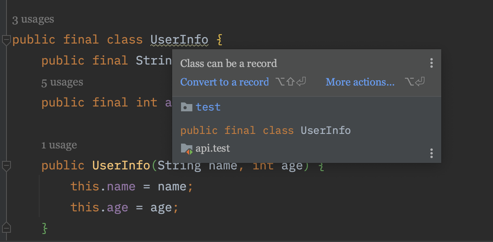
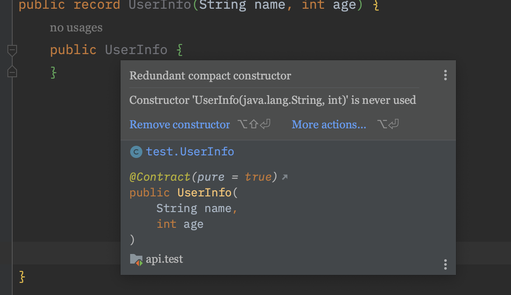
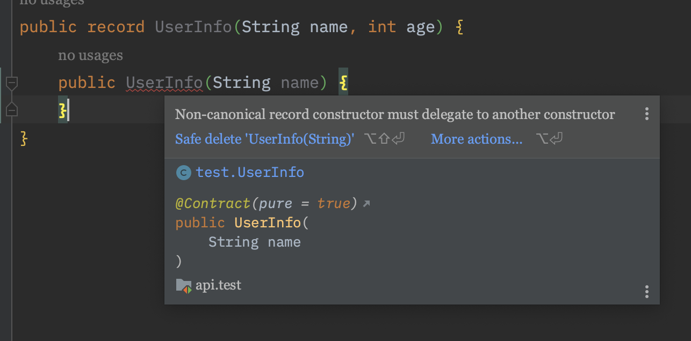

## 레코드는 무엇인가

우리는 흔히 이런 경험을 한다. 고작 단순한 데이터를 운반하는 일을 하는 객체를 모델링할 때 과도한 모델링으로 오버헤드가 발생하는 경험 말이다. 예를 들어, 보다 정확하게 객체를 모델링하려면 `생성자`부터, `equals()`, `hashCode()`, `toString()` 등  반복적인 코드를 많이 작성해야 했다.

레코드의 탄생은 이런 자바의 불편함에서 시작했다. 레코드는 코드를 들여다볼 때부터 “데이터 운반 객체”란 설계 의도를 파악하기 쉽다. 

다음 두 코드를 보면 그 차이가 확연히 들어난다.

```java
public final class UserInfo {
    public final String name;
    public final int age;

    public UserInfo(String name, int age) {
        this.name = name;
        this.age = age;
    }

    @Override
    public boolean equals(Object o) {
        if (this == o) {
            return true;
        }
        if (o == null || getClass() != o.getClass()) {
            return false;
        }
        UserInfo userInfo = (UserInfo) o;
        return age == userInfo.age && Objects.equals(name, userInfo.name);
    }

    @Override
    public int hashCode() {
        return Objects.hash(name, age);
    }

    @Override
    public String toString() {
        return "UserInfo{" +
            "name='" + name + '\'' +
            ", age=" + age +
            '}';
    }
}

```

회원 정보 클래스는 이름과 나이만 가지고 있다. 하지만 어마어마한 코드를 구현해야 한다. IDE의 힘을 빌리지 않고 위와 같은 코드를 직접 타이핑하며 구현했다고 생각해보자. 끔찍하다.

이를 해결하기 위해 다른 객체 지향 언어에서는 간결하게 모델링할 수 있는 데이터-지향 클래스를 마련하였다. 대표적으로 Kotlin의 `data` 클래스, C#의 `record`가 있다. 이들은 클래스의 초반부부터 이 클래스가 무엇을 하는지 한눈에 알아볼 수 있다는 공통점이 있다. 

이제 다음은 record를 보자.

```java
public record UserInfo(String name, int age) {

}

```

위의 코드와 비교했을 때 코드가 매우 간결해졌다. 코드의 초반부부터 한눈에 봐도 이름과 나이를 담고 있는 객체라는 것이 눈에 띄인다. 또 내가 구현하지 않아도 **자동으로 생성자부터, equals(), hashCode(), toString()** 를 구현해준다. 이런 측면은 이를 직접 구현했을 때보다 보일러플레이트를 줄여준다.

필자는 자바 17 버전을 사용하고 있는데 아래처럼 IDE에서 이렇게 친절하게 해당 클래스는 레코드가 될 수 있다고 표시해준다.


### 레코드 생성하기

회원 정보 클래스를 생성해보자.

```java
UserInfo jacob = new UserInfo("제이콥", 26);
String name = jacob.name(); //제이콥
int age = jacob.age(); //26

jacob.equals(jacob); //true
jacob.toString(); //UserInfo[name=제이콥, age=26]
jacob.hashCode(); //1576847917
```

내가 구현 하지 않았던 메소드들을 **자동**으로 구현해준다.

## 레코드의 생성자 만들기
**레코드 내부에 있는 필드는 모두 final로 선언되어 있다.** 따라서 생성자는 모든 필드를 초기화해야 한다. 레코드는 컴팩트(Compact) 생성자를 지원한다.

```java
public record UserInfo(String name, int age) {
    public UserInfo {
        doSomeLogic();
    }
}
```
해당 컴팩트 생성자는 전체 생성자를 호출하면서 '특정' 로직을 수행할 때 사용하면 유용하다.



IDE를 확인해보면 컴팩트 생성자를 호출하면 전체 생성자가 호출되는 것을 확인할 수 있다.

또 레코드는 기존의 우리가 알던 전체 생성자도 제공한다.

```java
public record UserInfo(String name, int age) {
    public UserInfo(String name, int age) {
        this.name = name;
        this.age = age;
    }
}
```
주의해야할 점은, 당연하겠지만 컴팩트 생성자와 전체 생성자 둘 중 하나만 구현할 수 있다는 것이다.

## 표준이 아닌(non-canonical) 생성자 만들 때
이런 경우가 있다 가정하자. 생성자로 하나의 값만 받아 초기화하고 싶은 경우다. 이때 전체 생성자가 아닌 필드의 생성자를 구현하면 `Non-canonical record constructor must delegate to another constructor`와 같은 에러 메세지가 나올 것이다.

```java
public record UserInfo(String name, int age) {
    public UserInfo(String name) {
    }
}
```



이유는 레코드의 모든 필드들은 내부에서 모두 final로 선언되기 때문에 기본값을 지정해줘야 하기 때문이다.

아래는 `this()`를 사용하여 표준이 아닌 생성자(`UserInfo(String name)`)가 표준 생성자(`UserInfo(String name, int age)`)를 호출하는 코드이다.

```java
public record UserInfo(String name, int age) {
    public UserInfo(String name) {
        this(name, 0);
    }
}
```

>참고
>
>https://davidvlijmincx.com/posts/using_record/
>https://openjdk.org/projects/amber/design-notes/records-and-sealed-classes